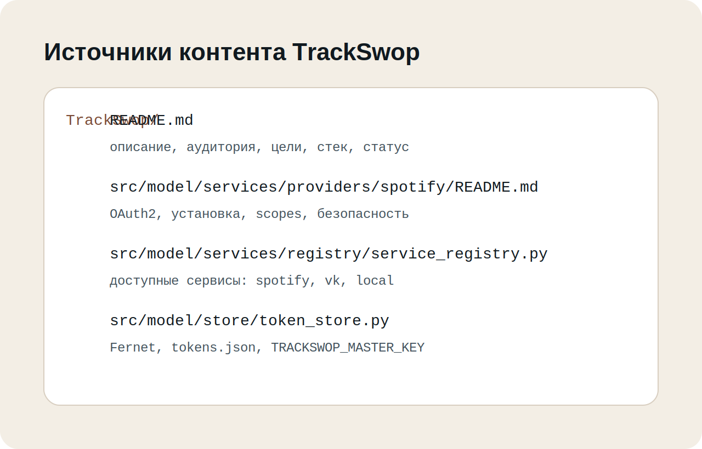
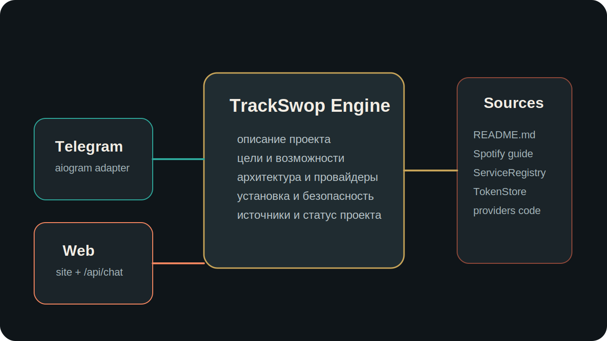
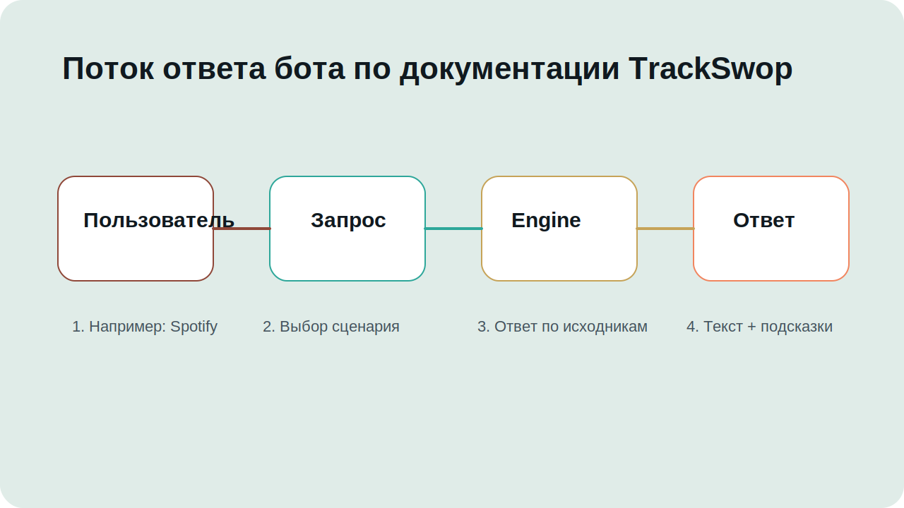

# Техническая документация проекта

## 1. Основной проект

В качестве проекта по дисциплине «Проектная деятельность» используется `TrackSwop`:

- репозиторий: https://github.com/Seregax/TrackSwop
- основной README: https://github.com/Seregax/TrackSwop/blob/main/README.md

По документации TrackSwop — это расширяемое desktop-приложение для импорта, экспорта и
управления музыкальными плейлистами между несколькими платформами, включая Spotify,
VK Music и локальные файлы.

## 2. Что сделано в рамках вариативной части

Вариативная часть оформлена как практическая реализация технологии Telegram-бота и
статического сайта по реальному проекту TrackSwop.

В качестве допустимого альтернативного источника, вместо списка из `build-your-own-x`,
использован open-source проект `TrackSwop`. Этот выбор в рамках практики зафиксирован как
согласованный с куратором проекта по проектной деятельности и ответственным по проектной
практике.

В локальном репозитории собраны три связанные части:

1. **Telegram-бот** в `src/`, который отвечает на вопросы по документации TrackSwop.
2. **Локальный web-режим**, использующий тот же движок ответов для демонстрации бота.
3. **Статический сайт** в `site/`, который представляет TrackSwop на русском языке.

## 3. Источники, на которых основаны тексты

Сайт и бот собраны не по абстрактным формулировкам, а по исходным материалам проекта:

- главный README TrackSwop;
- `src/model/services/providers/spotify/README.md`;
- код `ServiceRegistry`;
- код провайдеров `spotify`, `vk`, `local`;
- код `TokenStore`.



## 4. Какие факты перенесены из TrackSwop

Из документации и исходников в сайт и бота перенесены следующие блоки:

- назначение проекта и его целевая аудитория;
- цели и ключевые возможности;
- стек технологий;
- модульная архитектура и MVVM;
- список и особенности провайдеров;
- модель хранения и шифрования токенов;
- статус проекта и доступные ссылки на обратную связь.

## 5. Архитектура бота-справочника



Локальный Telegram-бот не повторяет логику TrackSwop, а документирует её. Для этого
используется простой движок ответов:

- `practice_bot/content.py` хранит нормализованный контент по TrackSwop;
- `practice_bot/engine.py` маршрутизирует пользовательские запросы;
- `practice_bot/telegram_app.py` подключает движок к Telegram через `aiogram`;
- `webapp.py` поднимает HTTP API `/api/chat` и раздаёт сайт;
- `site/js/app.js` работает с API и поддерживает fallback-режим.

## 6. Что именно рассказывает бот

Бот поддерживает сценарии:

- `О проекте`
- `Пользователи`
- `Цели`
- `Возможности`
- `Архитектура`
- `Провайдеры`
- `Spotify`
- `VK Music`
- `Local Files`
- `Установка`
- `Безопасность`
- `Тесты`
- `Статус`
- `Источники`



## 7. Соответствие заданию

Текущее решение закрывает следующие требования:

- структура репозитория соответствует `task/git_structure.md`;
- документация подготовлена в Markdown;
- сайт содержит аннотацию, описание проекта, участников, журнал и ресурсы;
- вариативная часть выполнена как Telegram-бот;
- тексты сайта и бота теперь основаны на документации и исходниках TrackSwop;
- в документацию и на сайт добавлены материалы по взаимодействию с организацией-партнёром.

## 8. Запуск локального проекта

### 8.1. Web-режим

```bash
python3 src/main.py web --port 8001
```

Сайт будет доступен по адресу `http://127.0.0.1:8001`.

### 8.2. Telegram-бот

```bash
python3 -m pip install -r requirements.txt
```

Создайте `.env` в корне репозитория:

```env
BOT_TOKEN=<telegram_bot_token>
WEBAPP_HOST=127.0.0.1
WEBAPP_PORT=8001
```

После этого выполните:

```bash
python3 src/main.py bot
```

## 9. Проверка

Минимальная локальная проверка:

```bash
python3 -m unittest discover -s tests
python3 -m compileall src
```

Для визуальной проверки достаточно открыть сайт и протестировать команды симулятора в
разделе `Telegram-бот`.
